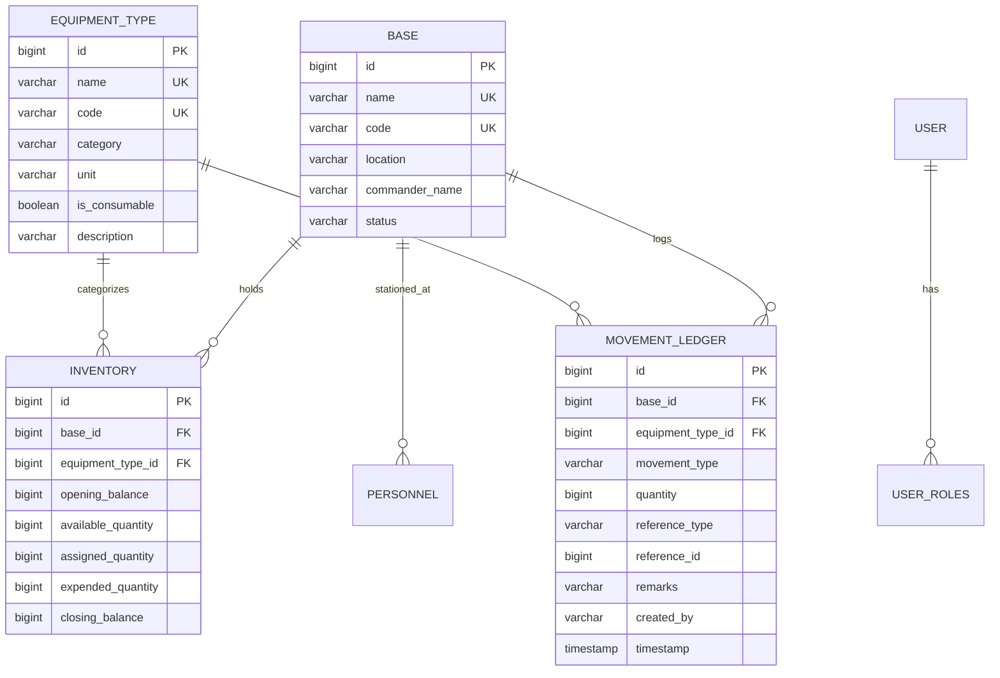

# 🛡️ Military Asset Management System (MAMS)

> **Enterprise Defense Logistics, Inter-Base Movements, Asset Lifecycle & Tactical Armory Auditing Platform**

[](https://spring.io/projects/spring-boot)
[](https://www.oracle.com/java/)
[](https://reactjs.org/)
[](https://vitejs.dev/)
[](https://www.postgresql.org/)
[](https://spring.io/projects/spring-security)
[](http://localhost:8080/swagger-ui/index.html)

---

## 📑 Table of Contents
1. [System Architecture & Overview](#-system-architecture--overview)
2. [Tech Stack Selection & Justification](#-tech-stack-selection--justification)
3. [Database Architecture & Schema Design](#-database-architecture--schema-design)
4. [Balance Calculation & Movement Formula](#-balance-calculation--movement-formula)
5. [Role-Based Access Control (RBAC) Matrix](#-role-based-access-control-rbac-matrix)
6. [Audit Logging & Ledger Immutability](#-audit-logging--ledger-immutability)
7. [Core Modules & Application Pages](#-core-modules--application-pages)
8. [API Reference & OpenAPI Swagger Docs](#-api-reference--openapi-swagger-docs)
9. [Installation & Local Setup](#-installation--local-setup)
10. [Automated Test Suite](#-automated-test-suite)

---

## 🏛 System Architecture & Overview

The **Military Asset Management System (MAMS)** is an enterprise defense logistics platform architected to maintain 100% accountability of critical defense assets—such as main battle tanks, fighter aircraft, precision-guided munitions, firearms, and tactical communication gear—across distributed military installations and sector command bases.

```
                  ┌──────────────────────────────────────────────────────────┐
                  │                 FRONTEND CLIENT (REACT 18)               │
                  │      Vite • Glassmorphism UI • Modular State Hook        │
                  └────────────────────────────┬─────────────────────────────┘
                                               │ HTTP / REST (JWT Auth)
                                               ▼
┌────────────────────────────────────────────────────────────────────────────────────────────┐
│                               BACKEND APPLICATION LAYER                                    │
│                              (Spring Boot 3.3.5 / Java 17)                                │
├──────────────────────────────┬─────────────────────────────┬───────────────────────────────┤
│    Security / Auth Filter    │     REST Controllers        │      Business Services        │
│ • Stateless JWT Auth         │ • DashboardController       │ • MovementServiceImpl         │
│ • Role-Based @PreAuthorize   │ • MovementController        │ • DashboardServiceImpl        │
│ • Password Encryption        │ • EquipmentController       │ • InventoryServiceImpl        │
│ • CORS & Session Protection  │ • BaseController            │ • PersonnelServiceImpl        │
│                              │ • PersonnelController       │ • ReportServiceImpl           │
├──────────────────────────────┴─────────────────────────────┴───────────────────────────────┤
│                                DATA ACCESS / ORM LAYER                                     │
│                     Spring Data JPA • Hibernate 6 • HikariCP Pool                          │
└──────────────────────────────────────────────┬─────────────────────────────────────────────┘
                                               │ ACID Transactions
                                               ▼
┌────────────────────────────────────────────────────────────────────────────────────────────┐
│                           RELATIONAL DATABASE LAYER (SQL)                                  │
│             `bases` • `equipment_types` • `inventory` • `movement_ledger`                  │
│                        `personnel` • `users` • `user_roles`                                │
└────────────────────────────────────────────────────────────────────────────────────────────┘
```

---

## 🎯 Tech Stack Selection & Justification

| Layer | Chosen Technology | Engineering Rationale & Justification |
| :--- | :--- | :--- |
| **Backend Framework** | **Spring Boot 3.3.5 (Java 17)** | Enterprise-grade stability, compiled type safety, robust dependency injection, production-grade metrics, and mature transaction managers (`@Transactional`) required for zero-error military logistics. |
| **Security & Auth** | **Spring Security 6 + JWT** | Stateless token authentication with `@EnableMethodSecurity` allows granular role-based authorization (`ADMIN`, `BASE_COMMANDER`, `LOGISTICS_OFFICER`) without server-side session overhead. |
| **Data Persistence** | **Spring Data JPA + Hibernate** | Object-Relational Mapping (ORM) ensures declarative database queries, automatic schema initialization, optimistic locking, and clean repository abstractions. |
| **Database Engine** | **Relational SQL (PostgreSQL / H2)** | Strict ACID transaction compliance, foreign key integrity, and zero double-spending guarantees required for mission-critical military inventories. |
| **API Documentation** | **SpringDoc OpenAPI 3.0 / Swagger UI** | Automated, interactive API contracts exposing all 27+ endpoints with schemas, example payloads, and live "Try it out" JWT authentication capabilities. |
| **Frontend Framework**| **React 18 + Vite** | Blazing-fast hot module replacement (<500ms build), clean functional component architecture, and responsive state management across desktop and mobile form factors. |
| **Styling & Design** | **Glassmorphism CSS Design System** | Custom tactical military aesthetic with dark palettes (`#061019`, `#0b202b`), high-contrast status tags, and responsive CSS grid architectures. |

---

## 🗄 Database Architecture & Schema Design

### Why a Relational Database (SQL) was chosen over NoSQL:
1. **ACID Transaction Guarantees**: Inter-base transfers require atomicity—deducting equipment from the source base armory and crediting it to the destination base armory must succeed together or roll back completely.
2. **Referential Integrity**: Every inventory count and movement ledger record is strictly bound to existing `Base` and `EquipmentType` foreign keys, preventing orphaned military assets.
3. **Complex Aggregations**: Mathematical ledger balancing (`SUM`, `GROUP BY`, date-window filters) executes directly on the database engine via indexed queries.

### Entity Relationship Diagram (ERD):



---

## 📐 Balance Calculation & Movement Formula

MAMS implements rigorous mathematical ledger reconciliation:

$$\text{Net Movement} = \text{Purchases} + \text{Transfers In} - \text{Transfers Out}$$

$$\text{Closing Balance} = \text{Opening Balance} + \text{Net Movement} - \text{Expended}$$

$$\text{Total Custody} = \text{Available in Base Armory} + \text{Assigned to Troops}$$

* Every action (procurement, transfer, assignment, expenditure) produces an immutable record in `movement_ledger` while updating real-time stock balances in `inventory`.

---

## 🔐 Role-Based Access Control (RBAC) Matrix

| Feature / Operation | HTTP Endpoint | HQ Admin | Base Commander | Logistics Officer |
| :--- | :--- | :---: | :---: | :---: |
| **View Dashboard & Metrics** | `GET /api/dashboard/*` | ✅ All Bases | ✅ Assigned Base | ✅ Read-Only |
| **Record Asset Procurement** | `POST /api/movements/purchase` | ✅ Full | ❌ Restricted | ✅ Full |
| **Initiate Base Transfers** | `POST /api/movements/transfer` | ✅ Full | ❌ Restricted | ✅ Full |
| **Assign Equipment to Troops** | `POST /api/movements/assign` | ✅ Full | ✅ Base Troops | ❌ Restricted |
| **Record Munitions Expended** | `POST /api/movements/expend` | ✅ Full | ✅ Base Drills | ❌ Restricted |
| **Return Gear to Armory** | `POST /api/movements/return` | ✅ Full | ✅ Base Armory | ❌ Restricted |
| **Create / Manage Bases** | `POST /api/bases` | ✅ Full | ❌ Forbidden | ❌ Forbidden |
| **Create / Edit Equipment Types**| `POST/PUT /api/equipment` | ✅ Full | ❌ Forbidden | ✅ Create Only |
| **Export Audit Logs (CSV)** | `GET /api/reports/export/csv` | ✅ Full | ✅ Base Logs | ✅ Movement Logs |

---

## 📝 Audit Logging & Ledger Immutability

1. **Tamper-Evident Ledger**: All transactions are written to `movement_ledger` with non-updatable database timestamps (`@CreationTimestamp`) and authenticated officer usernames (`SecurityContextHolder`).
2. **Audit Trails**: Supports chronological reconstruction of any asset's lifecycle—from original manufacturer purchase order to base redistribution, troop issuance, and combat expenditure.

---

## 📡 Complete REST API Directory & Swagger OpenAPI Specification (27 Endpoints)

All 27 endpoints are fully operational and documented at `http://localhost:8080/swagger-ui/index.html`.

### 1. 🔐 Authentication (`/api/auth`)
| Method | Endpoint Route | Description / Purpose | Security Clearance |
| :--- | :--- | :--- | :--- |
| `POST` | `/api/auth/login` | Authenticate user and get JWT access token | **Public** |
| `POST` | `/api/auth/register` | Register a new user account | **ADMIN** |
| `GET` | `/api/auth/me` | Get current authenticated user profile & role | **Authenticated** |

### 2. 📊 Dashboard Analytics (`/api/dashboard`)
| Method | Endpoint Route | Description / Purpose | Security Clearance |
| :--- | :--- | :--- | :--- |
| `GET` | `/api/dashboard/summary` | Get dashboard KPI summary (Opening, Purchases, Transfers In/Out, Net Movement, Assigned, Expended, Closing) | **All Roles** |
| `GET` | `/api/dashboard/recent-movements` | Get recent inventory movements and transactions | **All Roles** |
| `GET` | `/api/dashboard/category-distribution` | Get available inventory distribution by equipment category | **All Roles** |

### 3. 🛡️ Equipment & Assets Catalog (`/api/equipment`)
| Method | Endpoint Route | Description / Purpose | Security Clearance |
| :--- | :--- | :--- | :--- |
| `GET` | `/api/equipment` | Get list of all military equipment types | **All Roles** |
| `GET` | `/api/equipment/{id}` | Get equipment type details by ID | **All Roles** |
| `POST` | `/api/equipment` | Register a new military equipment / asset type into defense catalog | **ADMIN, LOGISTICS** |
| `PUT` | `/api/equipment/{id}` | Update an existing military equipment / asset type | **ADMIN, LOGISTICS** |
| `DELETE` | `/api/equipment/{id}` | Deactivate/decommission an equipment type (soft delete) | **ADMIN** |

### 4. 🔄 Movements & Logistics Ledger (`/api/movements`)
| Method | Endpoint Route | Description / Purpose | Security Clearance |
| :--- | :--- | :--- | :--- |
| `POST` | `/api/movements/purchase` | Record new procurement / purchase of assets into base inventory | **ADMIN, LOGISTICS** |
| `POST` | `/api/movements/transfer` | Transfer military assets from one base to another | **ADMIN, LOGISTICS** |
| `POST` | `/api/movements/assign` | Assign / Issue weapons or equipment to military personnel | **ADMIN, COMMANDER** |
| `POST` | `/api/movements/return` | Record return of assigned equipment back to base armory | **ADMIN, COMMANDER** |
| `POST` | `/api/movements/expend` | Record expenditure / consumption of ammunition or fuel during operations | **ADMIN, COMMANDER** |
| `GET` | `/api/movements` | Get transaction ledger history with optional filters | **All Roles** |
| `GET` | `/api/movements/{id}` | Get specific movement transaction details by ID | **All Roles** |

### 5. 📦 Live Inventory Matrix (`/api/inventory`)
| Method | Endpoint Route | Description / Purpose | Security Clearance |
| :--- | :--- | :--- | :--- |
| `GET` | `/api/inventory` | Get live inventory balances across all military bases | **All Roles** |
| `GET` | `/api/inventory/base/{baseId}` | Get live inventory balances for a specific military base | **All Roles** |
| `GET` | `/api/inventory/base/{baseId}/equipment/{equipmentTypeId}` | Get live stock balance for a specific equipment at a specific base | **All Roles** |

### 6. 👤 Defense Personnel & Officers (`/api/personnel`)
| Method | Endpoint Route | Description / Purpose | Security Clearance |
| :--- | :--- | :--- | :--- |
| `GET` | `/api/personnel` | Get list of all military personnel (optionally filter by baseId or role) | **ADMIN** |
| `GET` | `/api/personnel/{id}` | Get personnel details by ID | **ADMIN** |
| `POST` | `/api/personnel` | Register new military personnel/officer into system | **ADMIN** |
| `PUT` | `/api/personnel/{id}` | Update personnel details, base assignment, or military role | **ADMIN** |
| `DELETE` | `/api/personnel/{id}` | Deactivate/decommission personnel record (soft delete) | **ADMIN** |

### 7. ⌖ Military Bases & Installations (`/api/bases`)
| Method | Endpoint Route | Description / Purpose | Security Clearance |
| :--- | :--- | :--- | :--- |
| `GET` | `/api/bases` | Get list of all military bases | **All Roles** |
| `GET` | `/api/bases/{id}` | Get military base details by ID | **All Roles** |
| `POST` | `/api/bases` | Register a new military installation or command sector | **ADMIN** |

### 8. 📑 Reports, Expenditures & Audit (`/api/reports`)
| Method | Endpoint Route | Description / Purpose | Security Clearance |
| :--- | :--- | :--- | :--- |
| `GET` | `/api/reports/movements` | Get movement and procurement audit report with filters | **All Roles** |
| `GET` | `/api/reports/inventory-audit` | Get base armory inventory audit and stock health report | **All Roles** |
| `GET` | `/api/reports/expenditures` | Get ammunition and fuel operational expenditure report | **All Roles** |
| `GET` | `/api/reports/export/csv` | Export audit or inventory report directly to CSV file | **All Roles** |

---

## ⚡ Quick Start Guide

### 1. Prerequisites
- **Java 17 JDK** or higher
- **Node.js 18+** & npm
- **Maven 3.8+** (or bundled wrapper)

### 2. Backend Startup
```powershell
cd backend
mvn clean compile
mvn spring-boot:run
```
* Backend API live at: `http://localhost:8080`
* Interactive Swagger Docs: `http://localhost:8080/swagger-ui/index.html`

### 3. Frontend Startup
```powershell
cd frontend
npm install
npm run dev -- --port 5174
```
* Access Web Application at: `http://localhost:5174`

### 4. Default Seed Credentials
| Role | Username | Password |
| :--- | :--- | :--- |
| **HQ Supreme Admin** | `admin` | `password123` |
| **Base Commander** | `commander` | `password123` |
| **Logistics Officer** | `logistics` | `password123` |

---

## 🧪 Automated Test Suite

To run backend unit tests:
```powershell
cd backend
mvn test
```
* Includes test coverage for `MovementServiceTest`, `DashboardServiceTest`, and mathematical reconciliation validations.
